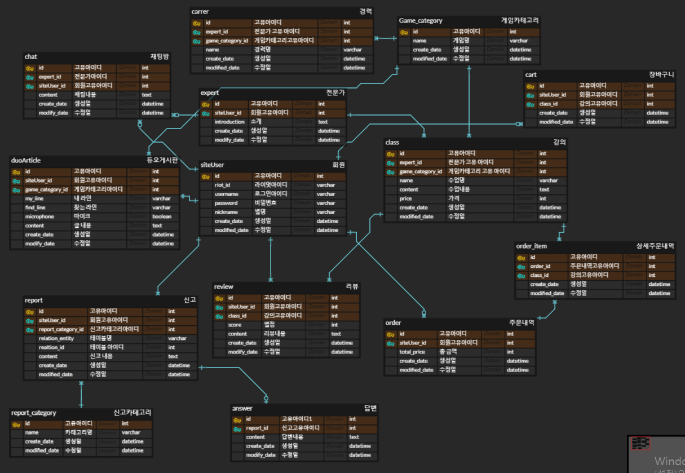

## GamePT(게임 과외 eCommerce 플랫폼)

### 서비스 설명 및 기획 의도

- E-sports 교육 연계 사업 모델 및 함께 게임 할 유저를 찾는 듀오 신청 서비스
- 스프링 부트를 이용한 eCommerce 제작 및 Riot-api를 이용한 듀오 신청 서비스 개발


[[기능정의서](https://docs.google.com/document/d/12oLpqgt0L2I_BdF_KKW2tpO2SkXREyM7zhsUKMOSxBc/edit)]

---

## 🛠 개발환경

1. 사용언어 : JAVA , MariaDB(MySQL), HTML5 , CSS , JS
2. JDK : Amazon Corretto version 17.0.9
3. 에디터 : IntelliJ IDEA, DBeaver
4. DB종류 : MariaDB(MySQL), Server(local)
5. 프레임워크 : SpringBoot
6. 라이브러리 : JPA, thymeleaf, security, lombok, Java-email, bootstrap, jquery


---

## ☁️ ERD ([링크](https://www.erdcloud.com/d/LqovpTTw8Z6LNTNdw))



---

## 👀 시연영상


---

## 🔥 트러블 슈팅

## 📢 1.

### 이슈 내역
- 채팅 전송 문제

### 문제점 설명
- 웹 소켓으로 1:1 채팅방 구현 후 하나의 채팅 메세지를 보냈는데, 같은 채팅이 여러번 보내짐


## 🚥 해결

- 현재 소켓 핸들러에서 연결된 세션과 해당 웹소켓 연결 정보를 담아두기 위한 리스트를 만들어 두었음.
```java
// 웹소켓 세션을 담아둘 리스트
List<HashMap<String, Object>> rls = new ArrayList<>(); 

@Override
    public void afterConnectionEstablished(WebSocketSession session) throws Exception {
        //소켓 연결
        super.afterConnectionEstablished(session);
        boolean flag = false;
        String url = session.getUri().toString();
        String roomNumber = url.split("/chat/")[1];
        int idx = rls.size(); //방의 사이즈를 조사한다.
        if(rls.size() > 0) {
            for(int i=0; i<rls.size(); i++) {
                String rN = (String) rls.get(i).get("roomNumber");
                if(rN.equals(roomNumber)) {
                    flag = true;
                    idx = i;
                    break;
                }
            }
        }

        if(flag) { //존재하는 방이라면 세션만 추가한다.
            HashMap<String, Object> map = rls.get(idx);
            map.put(session.getId(), session);
        }else { //최초 생성하는 방이라면 방번호와 세션을 추가한다.
            HashMap<String, Object> map = new HashMap<String, Object>();
            map.put("roomNumber", roomNumber);
            map.put(session.getId(), session);
            rls.add(map);
        }

        //세션등록이 끝나면 발급받은 세션ID값의 메시지를 발송한다.
        JSONObject obj = new JSONObject();
        obj.put("type", "getId");
        obj.put("sessionId", session.getId());
        session.sendMessage(new TextMessage(obj.toJSONString()));
    }

```

-  소켓이 종료되면 해당 세션값들을 세션 아이디로 통해  리스트에서 지움.

```java
@Override
    public void afterConnectionClosed(WebSocketSession session, CloseStatus status) throws Exception {
        //소켓 종료
        if(rls.size() > 0) { //소켓이 종료되면 해당 세션값들을 찾아서 지운다.
            for(int i=0; i<rls.size(); i++) {
                rls.get(i).remove(session.getId());
            }
        }
        super.afterConnectionClosed(session, status);
    }
```

## 결론 
## FrontEnd에서 다른 채팅방 이동시 소켓 연결을 끊고 다시 연결해야 소켓 연결이 쌓이지 않음

```javascript
$(".list-group-item").click(function(){
    $("#unClick").hide();
    $("#chat").show();
    roomNum = $(this).attr("value");

    var url = "ws://localhost:8010/wss/chat/"+roomNum;

    if(url == websocket.url){
        return;
    }

    $("#chattingArea").empty();

    getChattingRoom(roomNum);

    if(websocket != ""){
        websocket.close();
    }

    websocket = new WebSocket(url);
    websocket.onmessage = onMessage;

});
```

## 📢 2.

### 이슈 내역
- 라인 별로 articleList 를 나오게 하려 했으나, 해당 데이터를 html에 넘기지 못함

### 문제점 설명

```java
@Controller
@RequiredArgsConstructor
@RequestMapping("/api")
public class DuoArticleApiController {

    private final DuoArticleService duoArticleService;

    @GetMapping("/getDuoArticleList/{line}")
    public List<DuoArticle> getDuoArticlesByMyLine(@PathVariable(value = "line") String line, Model model) {
        List<DuoArticle> duoArticleList;
        if (line.equals("fill")) {
            duoArticleList = this.duoArticleService.getAllDuoArticles();
        } else {
            duoArticleList = this.duoArticleService.getDuoArticlesByMyLine(line);
        }
        return duoArticleList;
    }
}
```
```JS
function findByLine() {
            var selectedLine = $("input[name='sortByLine']:checked").val();  //클릭한 값을 저장
            $.ajax({
                type: 'GET',  //요청 타입 (get, post, put 등등)
                url: '/api/getDuoArticleList/' + selectedLine,   //요청할 url
                dataType: 'json',   //데이터 타입 (xml, json, text 등등)
                success: function (result) { // 결과 성공 콜백함수
                    console.log(result);
                    $("#duoArticle").X // 문제점
                },
                error: function (request, status, error) { // 결과 에러 콜백함수
                    console.log(error)
                }
            })
        }
```
```html
<tr id="duoArticle" th:each="duoArticle, loop : ${duoArticleList}">...</tr>
```

- 위와 같이 해당 리스트를 받아오는 것은 됐지만, 타임리프에서 쓰는 duoArticleList에 직접적으로 줄 수 없음


## 🚥 해결

1. 해당 데이터를 태그마다 지정(X)
```JS
function getArticleById(duoArticleId) {
            console.log(duoArticleId);
            $.ajax({
                type: 'GET',
                url: '/api/getDouArticle/' + duoArticleId,
                dataType: 'json',
                success: function (result) {
                    let duoArticle = result;
                    console.log(duoArticle);
                    $("input[name='myLine'][value='" + duoArticle.myLine + "']").prop("checked", true);
                    $("input[name='findLine'][value='" + duoArticle.findLine + "']").prop("checked", true);
                    $("input[name='microphoneCheck']").prop("checked", duoArticle.microphoneCheck);
                    $("textarea[name='content']").val(duoArticle.content);
                    $("button[name='createButton']").hide();
                    $("button[name='modifyButton']").show();
                    $("form[name='createForm']").attr("action", "/duo/modify/" + duoArticleId);
                },
                error: function (request, status, error) {
                    console.log(error);
                }
            })
        }

function findByLine() {
            var selectedLine = $("input[name='sortByLine']:checked").val();  //클릭한 값을 저장
            $.ajax({
                type: 'GET',  //요청 타입 (get, post, put 등등)
                url: '/api/getDuoArticleList/' + selectedLine,   //요청할 url
                dataType: 'json',   //데이터 타입 (xml, json, text 등등)
                success: function (result) { // 결과 성공 콜백함수
                    $.each(result, function(index, item) {  //반복문 추가
                    var listItem = '<li>' + item + '</li>';
                    $('#duoArticle').append(listItem);
                });
                    console.log(result);
                    $("#duoArticle").X // 문제점
                },
                error: function (request, status, error) { // 결과 에러 콜백함수
                    console.log(error)
                }
            })
        }
```
- 게시글 수정 기능에서 해당 데이터 게시글 데이터를 처리한 방식을 반복문으로 처리하는 방법

*문제점

 1)해당 반복문을 사용하는 tr태그 안의 내용이 방대해, 직접 하나하나 지정해주기 복잡하다.

 2)직접 지정해준 내용이 요청이 올 때마다, 반복문을 수행해야 한다.

2. jQuery replace
```java
@Controller
@RequiredArgsConstructor
@RequestMapping("/api")
public class DuoArticleApiController {

    private final DuoArticleService duoArticleService;

    @GetMapping("/getDuoArticleList/{line}")
    public String getDuoArticlesByMyLine(@PathVariable(value = "line") String line, Model model) {
        List<DuoArticle> duoArticleList;
        if (line.equals("fill")) {
            duoArticleList = this.duoArticleService.getAllDuoArticles();
        } else {
            duoArticleList = this.duoArticleService.getDuoArticlesByMyLine(line);
        }
        model.addAttribute("duoArticleList", duoArticleList);
        return "duo/list::#duoArticle";  //duoArticle부분만을 업데이트
    }
}
```
```JS
function findByLine() {
            var selectedLine = $("input[name='sortByLine']:checked").val(); //클릭한 값을 저장
            $.ajax({
                type: 'GET',              // 타입 (get, post, put 등등)
                url: '/api/getDuoArticleList/' + selectedLine,     // 요청할 url
                success: function (result) { // 결과 성공 콜백함수
                    $("#duoArticle").replaceWith(result); //table -> result 교체
                },
                error: function (request, status, error) { // 결과 에러 콜백함수
                    console.log(error)
                }
            })
        }
```
```html
<tr id="duoArticle" th:each="duoArticle, loop : ${duoArticleList}">...</tr>
```
- 위와 같이 컨트롤러에서 해당 경로를 지정하여 id가duoArticle부분만 업데이트 하고 script에서 해당 경로를 기존 태그 요소들을 새로 불러온 요소와 교체함

## 📢 3.

### 이슈 설명

- 리뷰 작성하기 버튼을 누르면 해당 작성 내용이 스크립트의 ajax 비동기요청을 통해 서버측으로 저장이 되고, 해당 리뷰 데이터를 서버가 넘겨 받아 DB에 저장 후, 최신화된 리뷰 내역(reviewList)를 뽑아 View 측으로 전달이 되어 해당 리뷰 부분만 바뀌는 형식이었다.

- 하지만 실제 코드의 리뷰생성 메서드는 DB에서 리뷰내역을 뽑고 새로 작성된 리뷰를 저장하는 형식이었다.

- 그럼에도 불구하고 실제 서비스에는 문제가 없이 작성한 리뷰가 추가되어 출력이 되었다.

- 마지막으로 /course/detail 엔드포인트로 불필요한 요청이 한번 더 일어남.

### 문제점 설명

- 리뷰 작성시 실행되는 ajax 일부분
```HTML

url : '/review/create'    // 요청할 서버url

$("#reviews").load(window.location.href + " #reviews");    
 // 결과 성공 콜백함수

window.location.href 란?      
//현재 페이지의 엔드포인트이다. /course/detail/(강의 id번호) 가 되겠다.
```
- load() 함수는 jQuery의 ajax기능을 사용하여 
   데이터를 가져오는 역할을 하는데 이때 요청을 한번 더 보내는 것이다.


- 리뷰 컨트롤러 일부분 (서버 측)
```java
public String create(Model model, ... , ...){

 ...
       List<Review> reviewList = reviewService.findByCourseId(id값)
        // 리뷰내역 불러오기
       reviewService.create(작성자,별점,리뷰내용);
        // 작성한 리뷰 저장하기

       model.addAttribute("reviewList", reviewList);
        // 모델에 리뷰내역리스트 객체 저장하기
 ...
}
```

- 강의 상세 페이지 일부분 (서버 측)
```java
@GetMapping("/detail/{id}")
    public String showCourseDetail(... , Model model) {

 ...
        List<Review> reviewList = reviewService.findByCourseId(id값);    
        // 페이지 처음 요청했을때 띄워야 해서 리뷰를 불러옴.

        model.addAttribute("reviewList", reviewList); 
        // 모델에 리뷰내역리스트 객체 저장하기 (이 부분 때문에 (reviewList)가 최신화가 되어버렸던 것이다.)
 ...
    }
```

## 🚥 해결

- 작성한 리뷰를 저장하고 최신화된 리뷰내역을 뽑아올 수 있도록 리뷰 컨트롤러의 로직을 수정했다.
```java
public String create(Model model, ... , ...){

 ...
       reviewService.create(작성자,별점,리뷰내용);      // 작성한 리뷰 저장하기
       List<Review> reviewList = reviewService.findByCourseId(id값)    // 리뷰내역 불러오기

       model.addAttribute("reviewList", reviewList);    // 모델에 리뷰내역리스트 객체 저장하기

       return "course/course_detail::#reviews";      // course_detail의 id를 reviews를 가진 부분만 데이터 재 전달.
 ...
}
```

- 이후, 불필요한 /course/detail(강의 상세페이지) 요청을 하지 않기 위해 콜백함수를 replaceWith로 수정해 주었다.
```html
success : function(result) {
        $('#reviews').replaceWith(result);  
        // (return "course/course_detail::#reviews";) 로 받은 result 데이터로 원래 reviews 부분을 최신화 하여 삽입.
}
```


